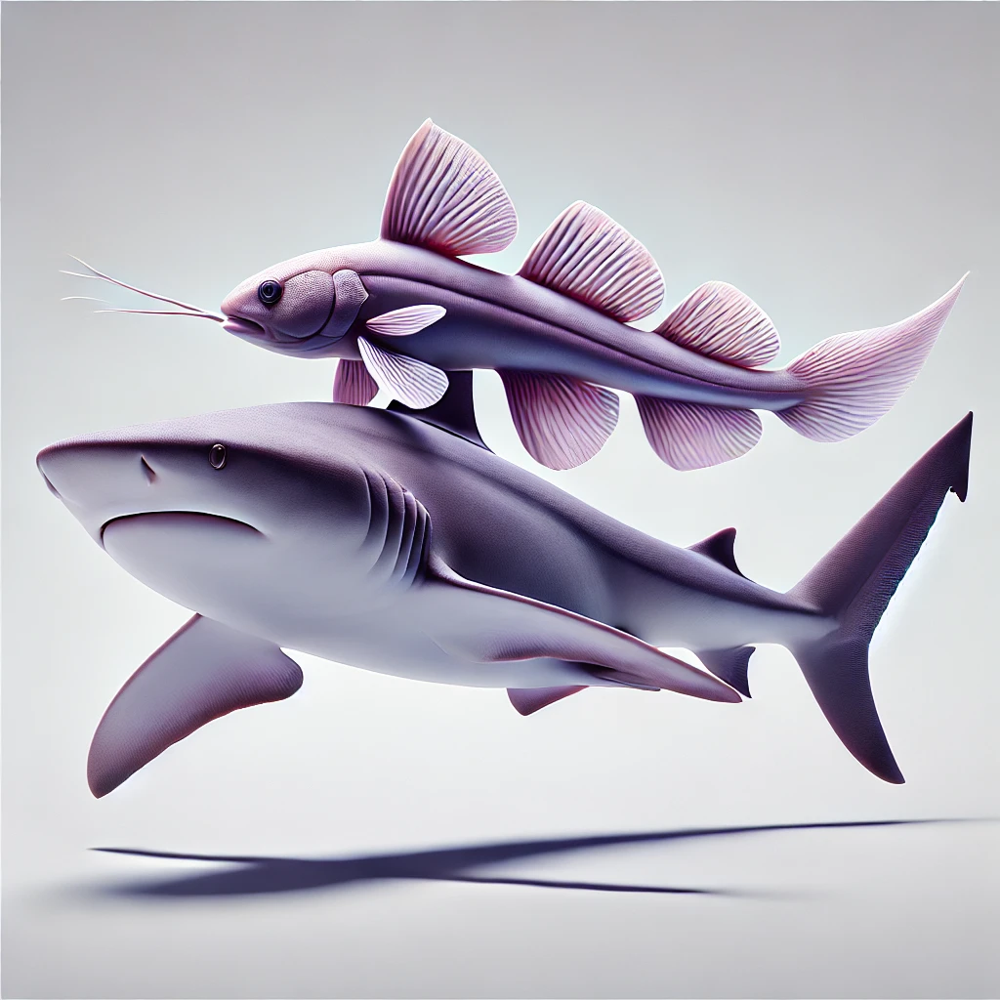

# Remora Project
Remoras are fish known for their unique relationship with sharks. These small fish, also called suckerfish, attach themselves to larger marine animals like sharks using a specialized disc on the top of their heads. This disc functions like a suction cup, allowing the remoras to travel along with their hosts.

By hitching a ride, remoras benefit from the scraps of food left behind by the shark's hunting activities. In return, they help clean the shark by eating parasites and leftover debris from its skin and gills. This mutualistic relationship is a great example of how different species can work together for mutual benefit in the animal kingdom.

# Idea
Bruce firmware, and all other firmware that try to accomplis flipper like functions, has the drawback of relying on comples schematics to connect chips like CC1101, NRF24, PN532 etc into it, making it a bit hard to use.

Remora is has the purpose to be a separate module, using UART communication to share information with Bruce (or other firmware), making it able to receive/transmit RF, and Infrared signals, control NRF24, and control PN532.

# Features available
* [ ] RF Receive/Transmit
* [ ] IR Receive/Transmit
* [ ] NRF24 Control
* [ ] PN 532

# bill of materials
* ESP32-S3 Super Mini
* CC1101
* 2xNRF24
* TSOP38238
* IR LED and a 2N222
* Grove Connector and cables

# How to use it
a library is supposed to be developped to make easier to use this module

# Contribute and helpo the project
https://buymeacoffee.com/bmorcelliz

## :construction: Disclaimer

Remora is a tool for cyber offensive and red team operations, distributed under the terms of the MIT License. It is intended for legal and authorized security testing purposes only. Use of this software for any malicious or unauthorized activities is strictly prohibited. By downloading, installing, or using Remora, you agree to comply with all applicable laws and regulations. This software is provided free of charge, and we do not accept payments for copies or modifications. The developers of Remora assume no liability for any misuse of the software. Use at your own risk.